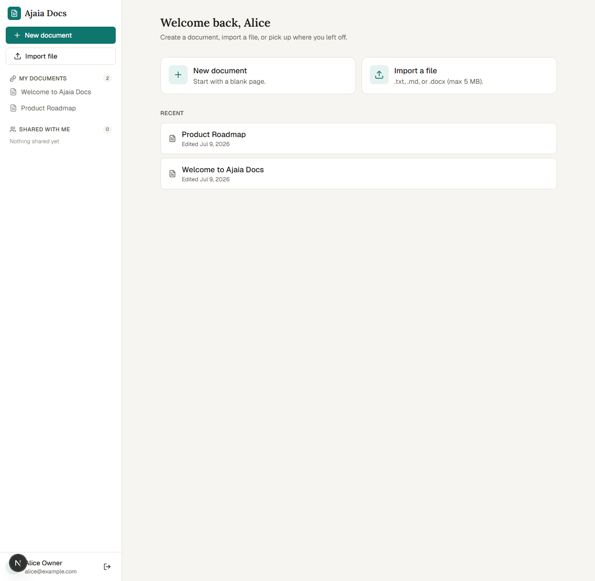
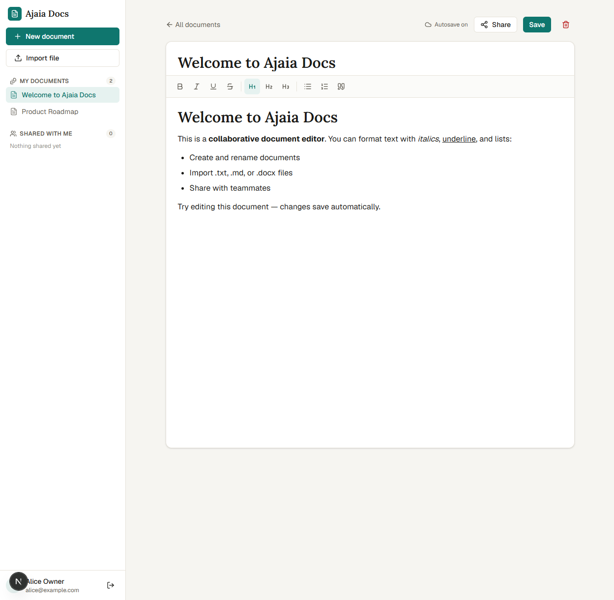
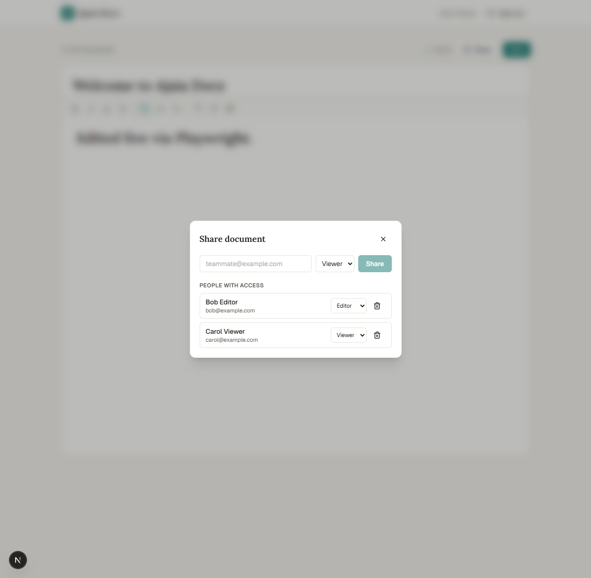
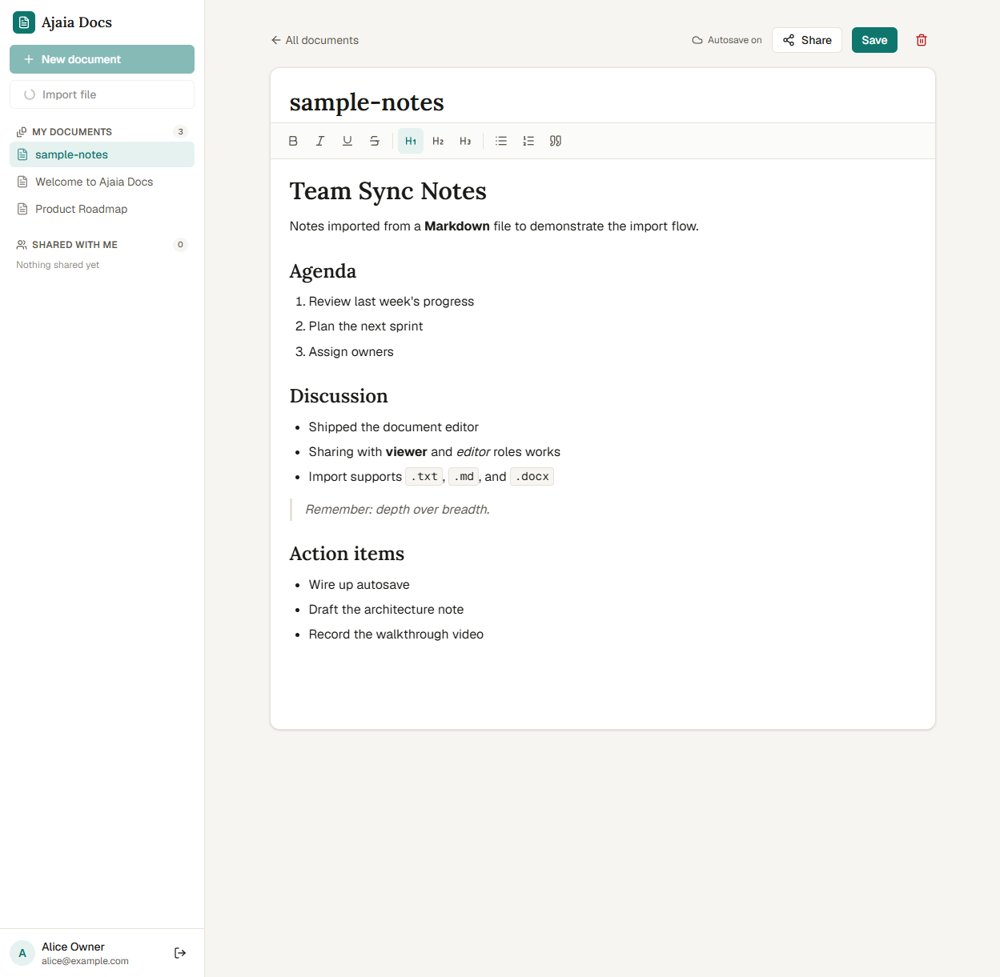
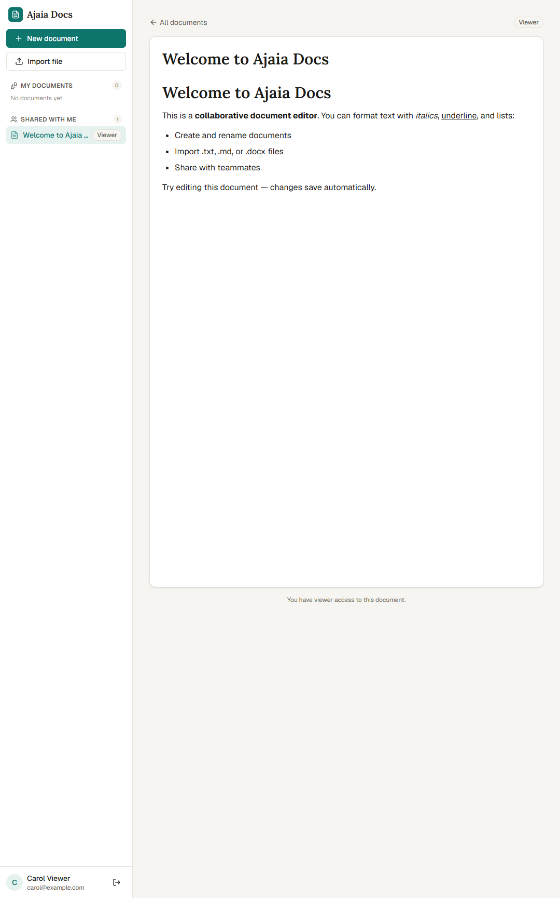

# Ajaia Docs

A lightweight collaborative document editor — think a focused slice of Google Docs. Create and edit rich-text documents in the browser, import files, and share with teammates using viewer / editor roles.

Built for the Ajaia AI-Native Full Stack take-home. The goal was **depth in a few areas** (editing UX, sharing/access control, file import) rather than shallow coverage everywhere.

> **Live demo:** _add your deployed URL here after following [docs/DEPLOY.md](docs/DEPLOY.md)_
>
> **Seeded accounts** (password for all: `password123`):
> | Email | Role in demo |
> |---|---|
> | `alice@example.com` | Owns 2 docs; shared "Welcome" with Bob & Carol |
> | `bob@example.com` | **Editor** on "Welcome to Ajaia Docs" |
> | `carol@example.com` | **Viewer** on "Welcome to Ajaia Docs" |

---

## What it does

- **Documents** — create, rename, edit, autosave, reopen. Rich text via TipTap: **bold**, *italic*, underline, strikethrough, H1–H3, bulleted & numbered lists, blockquotes.
- **File import** — upload a `.txt`, `.md`, or `.docx` file (≤ 5 MB) and it becomes a new editable document. Types are stated in the UI and enforced server-side.
- **Sharing** — an owner shares a document by email as **Viewer** (read-only) or **Editor** (can edit). The UI cleanly separates **My Documents** from **Shared with me**; access is enforced on every request.
- **Auth** — real login with seeded accounts, JWT in an httpOnly cookie.
- **Persistence** — Postgres; documents, shares, and formatting survive refresh and are demonstrable across accounts.

## Screenshots

| Home (sidebar) | Editor | Sharing |
|---|---|---|
|  |  |  |

| Imported Markdown | Viewer (read-only) |
|---|---|
|  |  |

## Architecture at a glance

Two independent services (mirrors the reference `avorino` stack), both deployable to Railway:

```
docs-web  (Next.js 16 · React 19 · React Query · Tailwind 4 / CVA · TipTap)
   │  browser calls same-origin /api/*
   ▼
docs-web /api/[...path]  (runtime reverse-proxy → first-party auth cookie, no CORS)
   ▼
docs-api  (Bun · Hono · Drizzle ORM · Zod)  ──►  PostgreSQL
```

- **Response envelope** and domain-driven layering (`route → controller → service → repository → schema`) follow the avorino conventions.
- **Auth cookie is first-party**: the web app proxies `/api/*` to the API, so the browser only ever talks to one origin — no cross-site cookies, no CORS headaches.
- See the full write-up in **[docs/architecture.md](docs/architecture.md)**.

## Repository layout

```
.
├── docs-api/          Bun + Hono + Drizzle + Postgres API
├── docs-web/          Next.js frontend
├── docs/
│   ├── architecture.md   design + tradeoffs
│   ├── ai-workflow.md    how AI was used
│   ├── DEPLOY.md         Railway deployment guide
│   └── screenshots/
├── samples/           example files to try the import flow
├── README.md          (this file)
└── SUBMISSION.md      deliverables manifest + status
```

## Run it locally

**Prerequisites:** [Bun](https://bun.sh) ≥ 1.2, [Docker](https://www.docker.com/) (for Postgres), and a free port for each service.

This is a single repository (monorepo) with two independently-deployable services. Root-level scripts orchestrate both.

### Quick start (from the repo root)

```bash
bun install            # root tooling (concurrently)
bun run setup          # install both services, start Postgres, migrate, seed
bun run dev            # run docs-api (:8080) and docs-web (:3000) together
```

Then open **http://localhost:3000**. Other root scripts: `bun run test`, `bun run build`, `bun run seed`, `bun run db:down`.

<details>
<summary>Or run each service manually</summary>

### 1. Start the API + database

```bash
cd docs-api
cp .env.example .env               # defaults work out of the box
docker compose -f docker-compose.dev.yml up -d   # Postgres on :5433
bun install
bun run db:migrate                 # create tables
bun run seed                       # seed demo users + docs
bun run dev                        # API on http://localhost:8080
```

### 2. Start the web app

```bash
cd docs-web
cp .env.example .env.local          # points /api proxy at http://localhost:8080
bun install
bun run dev                         # web on http://localhost:3000
```

Open **http://localhost:3000**, sign in with a seeded account (the login page has quick-switch buttons), and go.

</details>

> Supported import types: **`.txt`, `.md`, `.docx`** (max 5 MB). This is stated in the UI and enforced by the API.

## Tests

The API ships a meaningful integration test covering the whole access-control matrix:

```bash
cd docs-api
docker compose -f docker-compose.dev.yml up -d   # test uses the same dev DB
bun test
bun run seed                        # tests reset the DB — re-seed afterwards
```

It verifies: owner & editor can edit, viewer is read-only (403), a stranger gets 404 (existence not leaked), only the owner can manage shares, unauthenticated requests are 401, and `.txt` import creates an editable document. See [docs-api/tests/sharing.integration.test.ts](docs-api/tests/sharing.integration.test.ts).

## Deployment

Both services deploy to **Railway** from their `Dockerfile`s alongside a managed Postgres. Step-by-step guide (services, env vars, order): **[docs/DEPLOY.md](docs/DEPLOY.md)**.

## Scope & tradeoffs

**Deliberately included** (depth): a genuinely usable editor with autosave, real access control with roles enforced server-side, robust multi-format import, and a clean, deployment-friendly auth model.

**Deliberately deprecated** (with reasons in [docs/architecture.md](docs/architecture.md)): real-time collaboration, comments, version history, refresh-token rotation, and blob attachments. See [SUBMISSION.md](SUBMISSION.md) for what's done / incomplete / next.

AI usage is documented in **[docs/ai-workflow.md](docs/ai-workflow.md)**.
